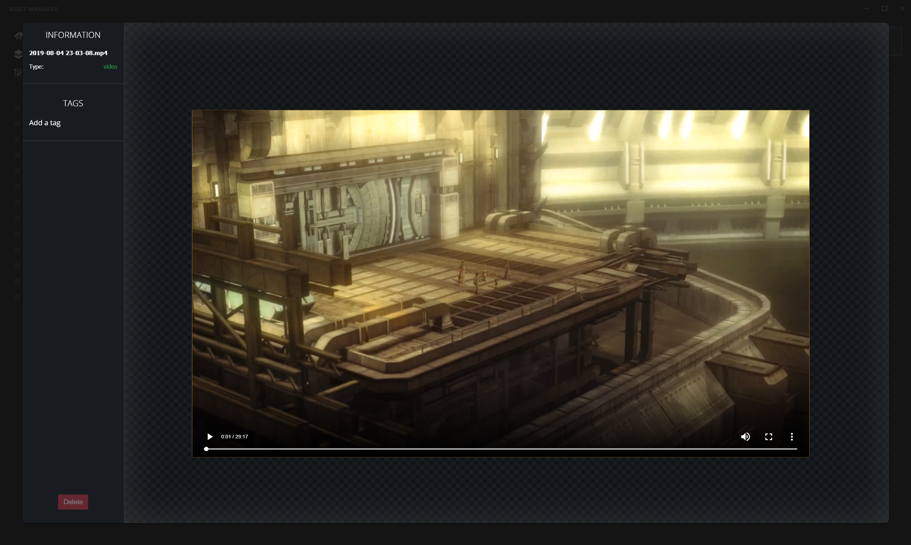

## Deving

- clone repo
- run `yarn`
- Dev: `bash bin/webpack dev`
- Prod: `bash bin/webpack prod`
- Electron: `bash bin/electron`

## Source files

- Styles: `src/css/**.scss`
- Javascript: `src/js/**.js`
- HTML: `public/index.html`

## Compiling the JS and SCSS

Make sure your IDE is set to: EMCAScript 6

(If you need SASS installed: `yarn add sass-loader node-sass --dev`)

- `yarn build` or `yarn build-dev` or `yarn build-dev --watch`

> Note: Always add packages with yarn, do not use NPM!!

## Compile

- `yarn dist` - This also compiles the CSS and builds the electron app installer.

This will build the installer to: `/dist/xx <version>.exe` which you can share and install.

## Dev Tools

Open with `CTRL+Shift+I`

## Screenshots

